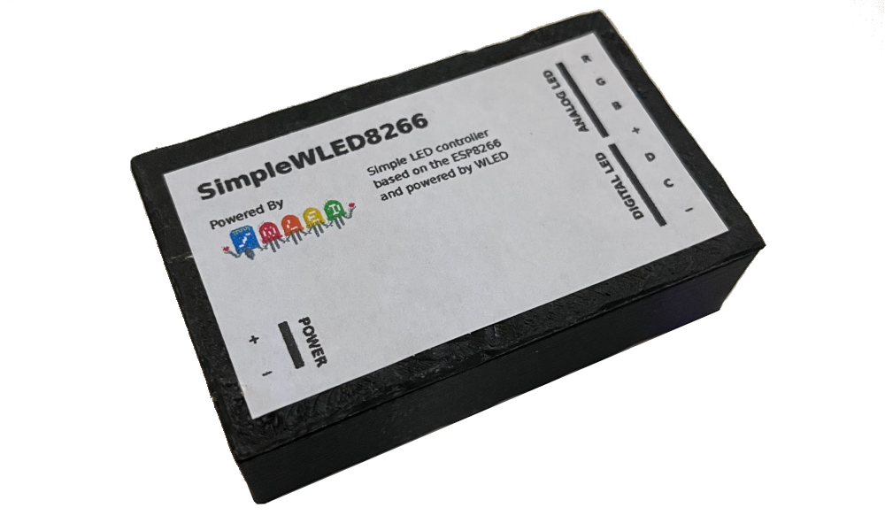

# SimpleWLED8266

SimpleWLED8266 is a simple, ESP8266-based, and WLED-powered LED controller board, supporting both analog and digital LED strips. The board features AO3400 mosfets to drive the analog LEDs and uses the 74AHCT125 buffer as a level-shifter for the digital LEDs which require 5V.

The board is very simple to solder since it only features a few parts and the smallest SMD part is of the size 0805. It does not use a switching regulator, reducing complexity and noise, but also decreasing the efficiency of the board. Make sure to pick 1117 regulators that support input voltages >12V! (e.g., LM1117 by TI)

The recommended software is [WLED](https://github.com/WLED/WLED), but other software like [ESPHome](https://esphome.io/) or [Tasmota](https://github.com/arendst/Tasmota) can also be used. Check out [this page](https://kno.wled.ge/basics/compatible-led-strips/) for a list of LED strips supported by WLED.

Disclaimer: This was made as a hobby project, so errors in the design are possible. Handle high voltages with care and do not overload the PCB since it can overheat and cause a fire. Please report problems in the design!

## Content

File/Folder                       | Description
----------------------------------|-------------------------------
simplewled8266/                   | KiCad project for the PCB
SimpleWLED8266_Case_Bottom.stl    | 3D-printable case (bottom)
SimpleWLED8266_Case_Bottom_ScrewMount.stl    | 3D-printable case (bottom, with screw mounts)
SimpleWLED8266_Case_Top.stl       | 3D-printable case (top)
SimpleWLED8266_Label.pdf          | Label for the 3D-printed case

## Wiring

The following GPIO functions need to be configured in WLED:

GPIO        | Function
------------|----------------------
12          | Red (analog)
5           | Green (analog)
14          | Blue (analog)
2           | Data (digital)
13          | Clock (digital)
0           | Button

## BOM

Quantity | Type       | Value       | Description
---------|------------|-------------|-------------------------------------
7        | Capacitor  | 100n        | Decoupling capacitors
1        | Capacitor  | 10u         | Capacitor
1        | Capacitor  | 470u        | Capacitor
1        | Fuse       | Fuse        | Fuse
1        | Connector  | PWR         | 
1        | Connector  | LEDs        | 
1        | Connector  | PROG        | 
3        | MOSFET     | AO3400A     | N-channel MOSFET for analog LEDs
2        | Resistor   | 62          | Between level-shifter and LEDs
8        | Resistor   | 10k         | Pull-up / pull-down resistors
1        | Switch     | SW_Push     | 
1        | Module     | ESP-12F     | ESP8266
1        | Buffer     | 74AHCT125   | Buffer as level-shifter to 5V
1        | Regulator  | AMS1117-5.0 | 5V linear regulator, Vin>=12V
1        | Regulator  | AMS1117-3.3 | 3.3V linear regulator, Vin>=12V

## Photos

Source of the WLED logo: https://github.com/wled/WLED/blob/main/images/wled_logo_akemi.png
